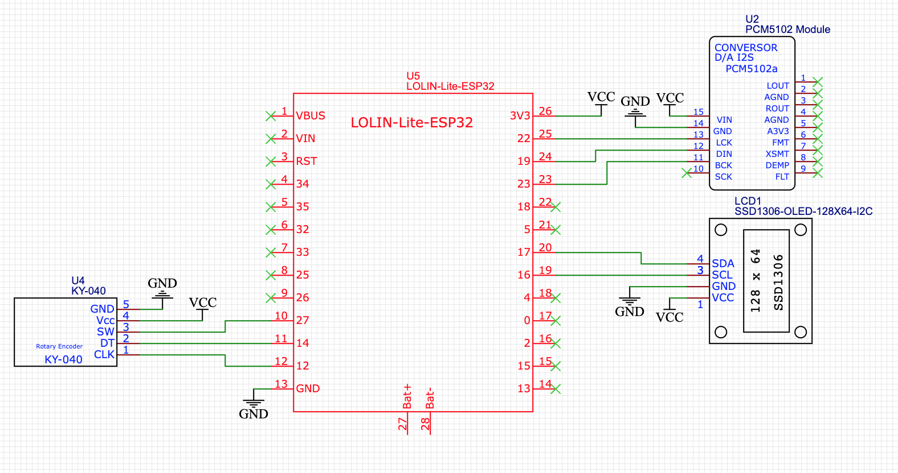
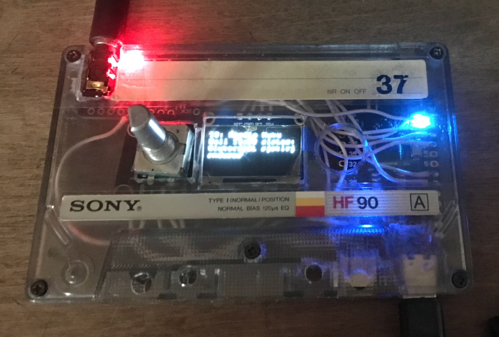

Another ESP32 Webradio project. The code contains 42 Estonian web radio streams. But of course you can replace them with the ones that suit you. 

You can find information at: https://www.radio-browser.info/countries

You need to use audio libary from: https://github.com/schreibfaul1/ESP32-audioI2S

Download it as a zip file and add it to your Arduino IDE.

The project is inspired and also used part of the code from these projects: https://en.polluxlabs.net/esp32-esp8266-projects/esp32-internet-radio/

and

https://www.az-delivery.de/en/blogs/azdelivery-blog-fur-arduino-und-raspberry-pi/internet-radio-mit-dem-esp32

Used parts. I bought them from Temu:

1. ESP32 Lite V1.0.0 

2. DAC: PCM5102

3. OLED Display Module - I2C/IIC, 128x64: SSD1306

4. KY-040 Rotary Encoder

NB! You may not be able to program ESP32s when peripherals are connected, as their power consumption prevents this.

Without problems, the components will not fit into the cartridge case, and you will have to cut it internally and remove the connectors that are already attached. In the picture below, I haven't finished it yet and I haven't fixed the components and I haven't made a window for the oled screen either.

Since this ESP32 (Wemos Lolin32 lite v1.0.0) also has a LiPo connection option, you can use it as an independent player. My goal was to connect it to my old receiver.

In the Arduino IDE, I chose the "ESP32 Dev Module" board because it gives more options for configuring the flashing (partitioning, etc.). However, there is no need to change them in this project.

Wifi settings are not written in to code. If the device cannot connect to the WiFi network for some reason, it starts in AP mode and creates AP "WEBRADIO". You then connect to it and go to Url: http:\\192.168.4.1 and enter your WiFi data. Corresponding information is also displayed on the Oled display. Note: ESP32 does not support 5G Wifi, only 2.4G

Pressing the Rotary Encoder switches modes between station mode and volume mode

Prototype: 

